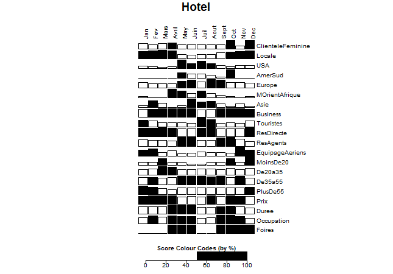
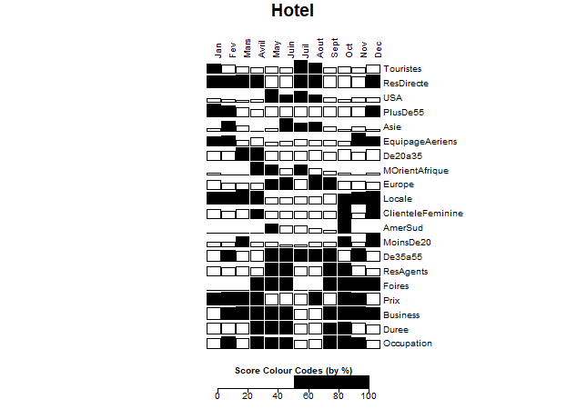

```R
install.packages("bertin", repos="http://R-Forge.R-project.org")

library(bertin)
data(Hotel)
View(Hotel)

plot.bertin(Hotel)

plot.bertin(Hotel, aspz=0.5)

plot.bertin(Hotel, palette=c("white","black"))

plot.bertin(
    Hotel, 
    roworder = bertin.order(bertinrank(Hotel, ties.method = "max"), 
    pivot="Occupation"), 
    palette=c("white","black")
  )
```

|  sin ordenar  | ordenado      |
| ------------- | ------------- |
|  |  |
