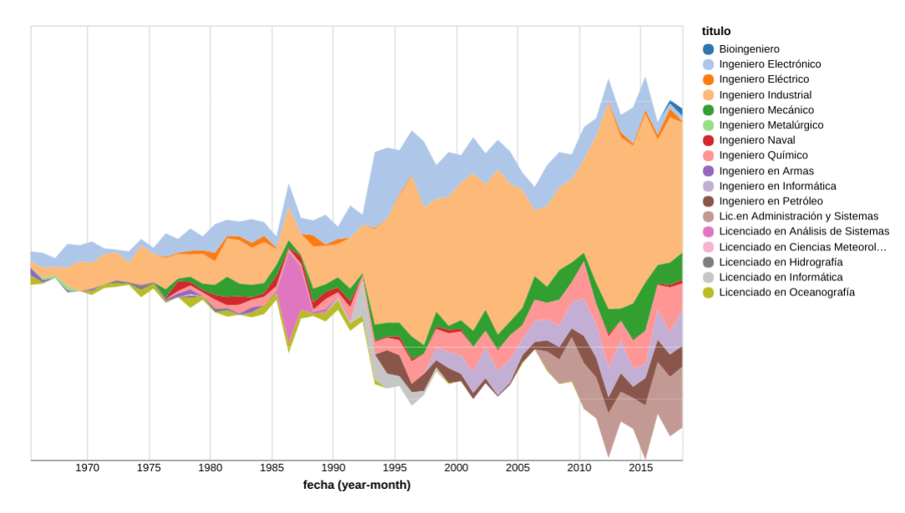

Con la siguiente especificacion, genero un streamgraph en [vega-lite](https://vega.github.io/editor/#/)

```
{
  "$schema": "https://vega.github.io/schema/vega-lite/v2.json",
  "width": 600, "height": 400,
  "data": {"url": "https://raw.githubusercontent.com/aaizemberg/vis/gh-pages/graduados/data.tsv"},
  "mark": "area",
  "encoding": {
    "x": {
      "timeUnit": "yearmonth", "field": "fecha", "type": "temporal",
      "scale": {"nice": "month"},
      "axis": {"format": "%Y", "labelAngle": 0, "tickSize": 0}
    },
    "y": {
      "aggregate": "sum", "field": "cant","type": "quantitative",
      "axis": null,
      "stack": "center"
    },
    "color": {"field":"titulo", "type":"nominal", "scale":{"scheme": "category20"}}
  }
}
```


